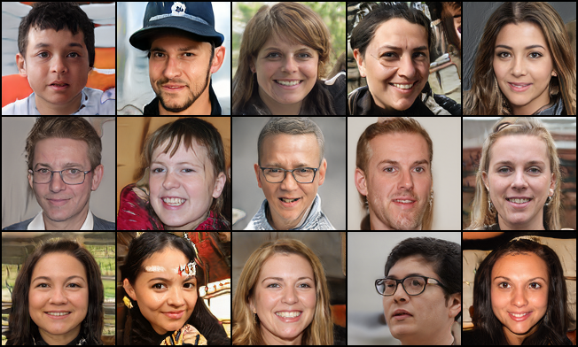
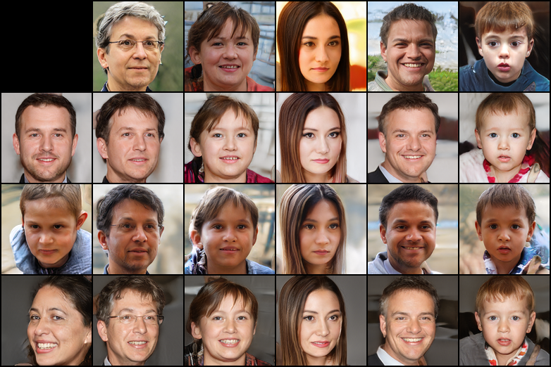

# StyleGAN-Jittor

A [Jittor](https://cg.cs.tsinghua.edu.cn/jittor) implementation of [StyleGAN](https://arxiv.org/abs/1812.04948).

Adapted from the [PyTorch version](https://github.com/rosinality/style-based-gan-pytorch).

## Training

Running `prepare_data.py` is not necessary. It will resize your images before training, rather than resizing while training. Using resized images requires you to modify `sample_data` function in `train.py` to use the `FolderDataset`.

To train your model, run `train.py`:

```
usage: train.py [-h] [--n_workers N_WORKERS] [--phase PHASE] [--lr LR]
                [--sched] [--init_size INIT_SIZE] [--max_size MAX_SIZE]
                [--ckpt CKPT] [--no_from_rgb_activate] [--mixing]
                [--loss {wgan-gp,r1}] [--save_dir SAVE_DIR] [--cpu]
                path

Progressive Growing of GANs

positional arguments:
  path                  path of specified dataset

optional arguments:
  -h, --help            show this help message and exit
  --n_workers N_WORKERS
                        batch sizes for each gpus
  --phase PHASE         number of samples used for each training phases
  --lr LR               learning rate
  --sched               use lr scheduling
  --init_size INIT_SIZE
                        initial image size
  --max_size MAX_SIZE   max image size
  --ckpt CKPT           load from previous checkpoints
  --no_from_rgb_activate
                        use activate in from_rgb (original implementation)
  --mixing              use mixing regularization
  --loss {wgan-gp,r1}   class of gan loss
  --save_dir SAVE_DIR
  --cpu                 use CPU only
```

Multi-GPU training example:

```shell
mpirun -np 4 python train.py --mixing --max_size 128 --sched --loss r1 --save_dir saved/FFHQ --n_workers 8 data/FFHQ
```

## Sampling

To sample results from checkpoints, run `sample.py`:

```
usage: generate.py [-h] [--size SIZE] [--n_row N_ROW] [--n_col N_COL] [--cpu]
                   path

positional arguments:
  path           path to checkpoint file

optional arguments:
  -h, --help     show this help message and exit
  --size SIZE    size of the image
  --n_row N_ROW  number of rows of sample matrix
  --n_col N_COL  number of columns of sample matrix
  --cpu          use CPU only
```

## Results

Here we show some results sampled from our trained 128x128 FFHQ model. I only trained 270k iters so it has not converged yet.




